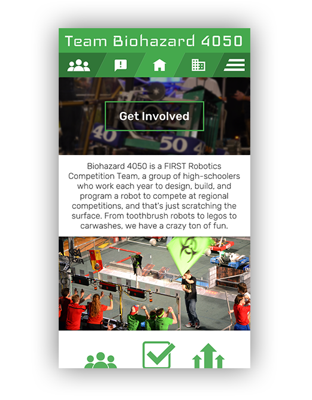

# Project Arc

## The End Game


## Setup
Firstly, make sure that you have npm installed (`npm --version`). Then, run `npm install` to install all the development dependancies.

#### Development
After completing the setup steps, run `npm run dev` to start the development server. It should open up the compiled version of index.html in your browser. Any changes made should result in automatic repacking and refreshing of the page. **Take note:** All changes will stay in memory and the webpack dev server will not write any files to the disk.

Webpack exposes the Vue app variable under the `site`  object. For example to change the pageContent app data, we could do
```
site.app.pageContent = "Goodbye World!";
```

#### Building for Distribution
Running `npm run build` will do all the packaging and minify the HTML, CSS, and JS. The CSS and JS will also be combined. Afterwards, they will be written to the ./dist directory. Imports will automatically be added to the HTML.
